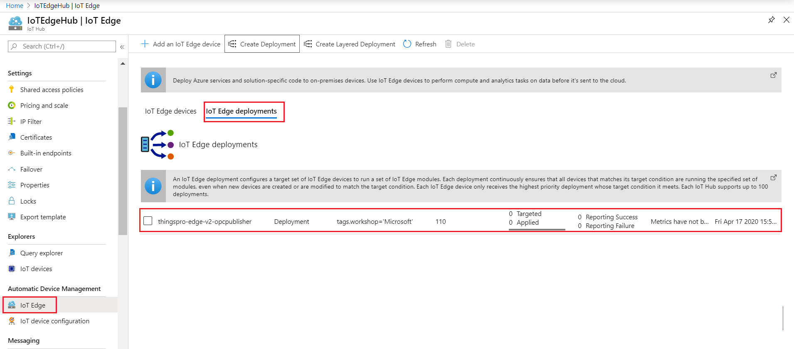
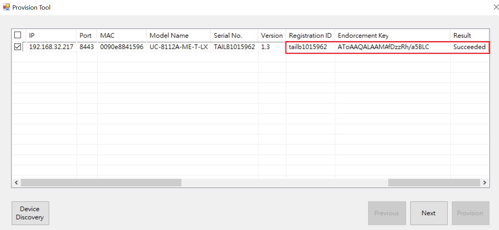
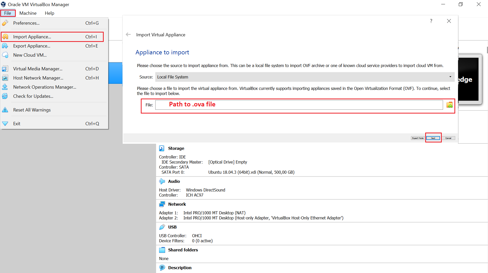
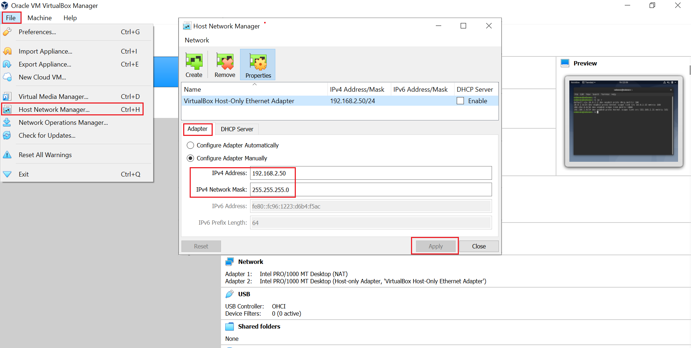

# Connecting OPC-UA PLCs to azure iot hub using Moxa UC-8112A IIoT Gateway running Microsoft OPCpublisher Container (Azure IoT Edge + ThingsPro Edge)

## This document lists the following steps:
   - Basic Device Setup
   - Cloud Setup
   - Setup Provisioning Tool
   - Verify Modules on UC-8112A IIoT Gateway
   - Data Setup
   - Monitor OPC-UA Server D2C Telemetry data from Azure IoT Hub

# Basic Device Setup

## Default credential and IP address
  - username/password:  moxa/moxa
  - IP LAN1 192.168.3.127 
  - IP LAN2 192.168.4.127

## Set to Default

Reset to factory default

If the unit has been installed prior, we should reset it back to default before installing ThingsPro Edge. The commands listed below is for `armhf` and UC-8100A series gateway

```sh
mx-set-def
```

> Note: Make sure to have a console cable connected to the device or login via ssh

Remove docker folder
```sh
rm -rf /overlayfs/docker /overlayfs/working/docker
```

> Note: This will wipe out all the data on the device!

## Configure Network
```sh
dhclient eth0
```
> Note: Make sure there is a dhcp server on LAN1

## Download and Install ThingsPro Edge V2.0.0 on UC-8112A with Internet 
- armhf:
    ```sh
    wget https://thingspro.blob.core.windows.net/software/edge/V2.0.0/update_2.0.0-1579-uc-8112a-me-iotedge_armhf.deb
    dpkg -i ./update_2.0.0-1511-uc-8112a-me-iotedge_armhf.deb
    ```
## Download and Install ThingsPro Edge V2.0.0 on UC-8112A without Internet
Click on the url below or copy url it on your web browser which starts downloading thingspro software, it takes 10~12 minutes depending the network speed of your internet connection. 
 ```sh
https://thingspro.blob.core.windows.net/software/edge/V2.0.0/update_2.0.0-1579-uc-8112a-me-iotedge_armhf.deb
 ```
 

After the download is completed, copy .deb package file on the UC gateway via FTP

> Hint: On Windows10 use WinSCP tool. It is free tool available on the url below. 
 ```sh
https://winscp.net/eng/download.php
 ```
 - armhf:
     ```sh
     dpkg -i ./update_2.0.0-1511-uc-8112a-me-iotedge_armhf.deb
     ```

## Update the Installation Process
```sh
journalctl -u update -f
```

## Track Installation Progress
   

> Note: The entire process will take about ~11 minutes depends on the hardware/model. When it shows "Stopped MOXA ThingsPro Updater", you can reboot the device by command listed below. The SSH service will be disabled after TPE is installed. 

## Reboot Device
```sh
sudo reboot
```

# Cloud Setup

## Setup a Device Provisioning Service (DPS) using Azure portal

Please use the url below to set up a DPS on azure portal. The url includes three steps. 
 1.  Create an Iot hub instance
 2.  Create a new IoT hub DPS
 3.  Link Iot hub and your DPS

```sh
https://docs.microsoft.com/en-us/azure/iot-dps/quick-setup-auto-provision
```

## Configure IoT Edge Auto-Deploment using Azure portal

 > Note: Here we add total two modules for our deployment, one thingspro-agent a system module for device management for Moxa UC-8112A IIOT gateway and second microsoft opcpublisher module for data acquisition

- Create IoT Edge Deployment
 
 
- Name and Label

Specify unique name for your deployment then select Next
 
 
 ## thingspro-agent
 
- Modules
  
  - Image URI:
      - armhf:
            ```
            moxa2019/thingspro-agent:2.0.0-528-armhf 
            ```

   
    - Container Create Options:
    ```
    {
         "HostConfig": {
             "Binds": [
                 "/var/thingspro/apps/cloud/data/setting/:/var/thingspro/cloudsetting/",
                 "/run/:/host/run/",
                 "/var/thingspro/data/:/var/thingspro/data/"
              ]
          }
    }
    ```
    
## opcpublisher
- Modules
  
  - Image URI:
       - armhf:
            ```
           mcr.microsoft.com/iotedge/opc-publisher:2.3.0 
            ```

   
    - Container Create Options:
    ```
    {
         "Hostname": "publisher",
          "Cmd": [
             "--aa"
           ]
    }
    ```
    
- Modules

After you finished adding the iotedge module, you will redirect to the main page where two iotedge modules were added in the list as you can see in the image below  


- Routes
    
    - NAME:
        ```
        route
        ```
    - VALUE:
        ```
        "FROM /messages/* INTO $upstream"
        ```
        
   - NAME:
        ```
       opcpublisherToIoTHub
        ```
    - VALUE:
        ```
        "FROM /messages/modules/opcpublisher/* INTO $upstream "
        ```

- Target Devices
   
    - Target Condition:
        ```
        tags.workshop='Microsoft'
        ``` 
- Review + create
   
   
- Verify IoT Edge Deployment
   

# Setup Provisioning Tool

Discover and enroll IIoT devices on your designated Azure IoT Hub using Moxa Provision Tool

## Download Provisioning Tool from the given url 

  ```
  https://moxa-my.sharepoint.com/:u:/p/amjad_badar/EWsKcxcRjlVKju6DH7Tee8YBGX0cBnzgX1csIGhTTHo-Kw?e=nWfM4Z
  ```

## Setup Provisioning Enviornment 


> Note: Make sure that notebook is connected on same the local network as shown in the topology. The discovery service works only on LAN1 on UC-8112A IIoT gateway.

## Provision Tool

- Modify Configuration File
    ```
    {
        "steps": [
            {
            "target": "Predefined",
            "description": "",
            "path": "",
            "method": "provision iot edge using dps",
            "post": {
                "scope": "{Service Endpoint of DPS}",
                "keyName": "{Shared Access Policy}",
                "key": "{Shared Access keys}",
                "scopeId": "{ID Scope of DPS}",
                "iotHubHostName": "{Target IoT Hub}",
                "initialTwin": {
                "properties": {},
                "tags": {
                    "{Key}": "{Value}"
                }
                },
                "generateDownstreamCertificate": true,
                "enableIoTEdge": true
            }
            }
        ]
    }
    ```

- Device Discovery 

  

- Select Target Devices  

  

- Provide Device Credential and Specify Provision Configuration   

  

- Provision

  

> Note: The provision tool automatically retrieves the Registration ID (SN of the device) and TPM Endorsement key of UC-8112A gateway

- Verifying the device enrollment status on Azure DPS  

  

- Verifying the device registration status on Azure DPS

  

- Verifying the device registration status on Azure IoT Hub  

  

> Note: Device ID is the serial number of the Moxa UC-8112A IIoT gateway

- Check status IoTEdge Deployment 
  
  As you can see in the figure below under "System Metrics"column the deployment has been successfully applied to the device 
  
  

- Check IoTEdge device Module Runtime Status 

  
  
> Note: After successfull deployment the iotedge device pull the module images specified in the deployment manifest and start the container from the image. This takes 4~5 minutes depending on the network speed. The iot edge device sends the status updates via reported properties to azure iot hub.

# Verify Modules on UC-8112A IIoT Gateway

## Connect the gateway via Local Web GUI 

Default credentials 
  - username/password:  admin/admin@123


## Azure IoT Edge
 


# Data Setup 

## Download and Install Orcale Virtual box for your OS
 ```
https://www.virtualbox.org/wiki/Downloads
 ```

## Download pre-built Debian VM Open Virtualization Appliance (.ova) file running Codesys OPC-UA server 
 ```
https://moxa-my.sharepoint.com/:u:/p/amjad_badar/Ebq22gjUqfdNoxT3PZtoQjcBMlp8zx5G805qXC7Eo0KkhA?e=yzXMnM
 ```

## Import .ova file using Virtual Box

- Import Appliance
  

- Appliance Settings
  

> Note: By deafult the VM is configured 2048 MB RAM, you can reduce the size of the RAM or leave as default settings. Please be patience it takes a few minutes for ova file to be imported. Once the ova file has imported successfully you can start the VM.  

- Set VirtualHost Adpater Static IP
  

- Start VM
  > Note: The OPC-UA server will starts automatically when you start the Virtual Machine
  
  The opcua server contains a small PLC program which includes one digital input (Switch) and digital output (Lamp). 
  You can connect to the OPC-UA server locally by using the OPC client UaExpert software as shown in the next section. 
  
  Default username/password:  osboxes/osboxes.org
  

## Download and Install OPC UaExpert Client (optional)
  The OPC-UA expert software available free from the OPC foundation, by using the OPC-UA client you can browse the address space (Node IDs) of OPC-UA server, read/write data, copy node ID of specific variable and etc. Please check OPC-UA website for further details. 
  
  Please use the following link to download the software.
  
 > Note: You might need to create an account in order to download the software
  
   ```
  https://www.unified-automation.com/downloads/opc-ua-clients.html
   ```
   
 - Setup Connection
 
   Codesys SoftPLC OPC-UA Server IP: 192.168.2.31  
   
   

- Discover OPC-UA Server

   
   
- Connected to the Server

   
   
- Browse Address Space OPC-UA Server
  
  Copy NodeID of the lamp_output variable and use this in the payload of the invoke direct method in the next section. 
  
    
    

## Invoke Direct Method from Azure IoT Hub

- Select opcpublisher module from the module list on your iotedge device

   
   
- Select Direct Method

   
   
- Invoke Direct Method 

  
     
     - Method Name:
        ```
        PublishNodes
        ```
    - Payload:
        ```
        {
               "OpcNodes": [
              {
                   "Id": "ns=4;s=|var|CODESYS Control for Linux SL.Application.PLC_PRG.Lamp_output",
                   "OpcSamplingInterval": 1000,
                   "OpcPublishingInterval": 1000
              }
              ],
             "EndpointUrl": "opc.tcp://192.168.2.31:4840",
             "UseSecurity": false
         }
        ```
        
 
    
# Monitor OPC-UA Server D2C Telemetry data from Azure IoT Hub

## Download and Install Azure IoT Explorer (.MSI)
```sh
https://github.com/Azure/azure-iot-explorer/releases
```
## Use Azure IoT Explorer to Monitor D2C telemetry data


## Modify OPC-UA Server Switch value 
The opcpublisher module doesn't publish the same data to the IoT Hub rather it publish data on changes. In order to see the lamp_output on change, force the switch input on UaExpert and verify the corresponding output using azure iot explorer as shown in the image below. 


